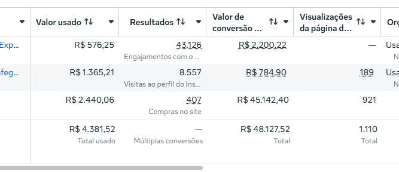

<noscript></noscript>

## A boa notícia é que o digital funciona, mas é preciso definir bem quem é que compraria de você.

Existe uma frase muito comum no mercado:

> *"Acho que meu público é…"*

E é exatamente aqui que muitos negócios começam a crescer devagar, comunicar errado e atrair pessoas que talvez nunca fossem comprar.

Porque uma coisa é interesse.
Outra coisa é desejo real.
E existe uma diferença muito grande entre quem apenas olha sua vitrine e quem realmente está pronto para entrar.

Enquanto você tenta descobrir "quem é seu avatar", seu cliente já está deixando pistas todos os dias. Nas perguntas que faz, nas dúvidas repetidas, nos elogios, nas objeções e até no momento em que decide comprar de você ao invés de outra pessoa.

O problema é que quase ninguém aprende a observar isso com atenção.

---

E foi justamente por isso que escrevi esse material.

Esse não é um ebook sobre criar avatar bonitinho ou definir faixa etária do seu público. É um material sobre **comportamento de compra, percepção e comunicação**.

Porque no final das contas, quem entende o comportamento do cliente consegue comunicar valor de uma forma completamente diferente.

Esse framework que criei é poderoso justamente porque nasce da observação prática do mercado. São **7 práticas** que acredito fazer diferença para praticamente qualquer dono de negócio que queira crescer entendendo melhor o próprio consumidor.

E se você chegou até aqui lendo isso e sentiu que em algum momento já olhou para essas coisas, mas acabou deixando passar na correria do dia a dia, então provavelmente esse material é para você.

---

Da prática 1 até a 7, abordamos:

- Como identificar padrões na sua clientela
- Como perceber o que realmente faz alguém comprar
- Como observar melhor as objeções que afastam clientes do seu negócio
- Como entender o momento psicológico e o nível de consciência em que cada pessoa se encontra durante a jornada de compra

Porque a verdade é que muita gente boa tem produto bom, atendimento bom e intenção boa… mas ainda **comunica no escuro**.

---

E quando você aprende a observar o comportamento do seu público com mais clareza, tudo começa a mudar aos poucos.

Sua comunicação muda.
Sua percepção de valor muda.
Sua forma de vender muda.
E principalmente: você para de depender tanto do "achismo".

---

O mercado mudou muito nos últimos anos.

Hoje não basta apenas ter um bom produto. As pessoas precisam sentir **confiança, identificação e clareza** muito rápido para continuar prestando atenção em você.

E isso só acontece quando você entende melhor quem está do outro lado.

---

Você não precisa de mais um conteúdo genérico sobre marketing.

Talvez precise apenas começar a enxergar, com mais atenção, aquilo que seu cliente já vem tentando mostrar faz tempo.

  
O ebook tá com um cupom pros 50 próximos compradores.. era 47 reais na oferta normal.

  
Use o cupom <strong style="background: #1e1e1e; color: #C49A1E; padding: 0.2rem 0.6rem; border-radius: 3px; letter-spacing: 0.05em; font-family: monospace;">50PRIMEIROS</strong> no checkout.

  <a onclick="return false;" href="https://pay.hotmart.com/V105408718W?checkoutMode=2&off=x9tge63f" class="hotmart-fb hotmart__button-checkout" style="display: inline-block; background: #C49A1E; color: #0F0F0F; font-weight: 700; font-size: 1.05rem; padding: 0.85rem 2rem; border-radius: 4px; letter-spacing: 0.02em; text-decoration: none; cursor: pointer;">
    Acessar oferta
  </a>

